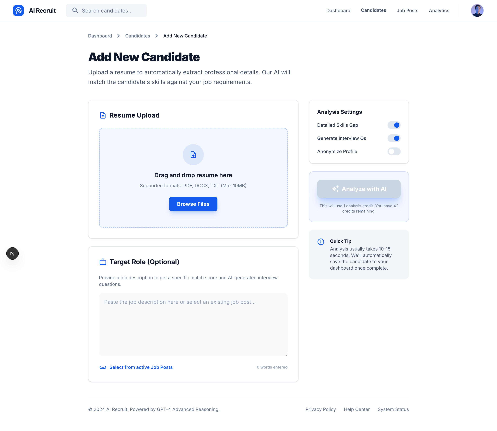
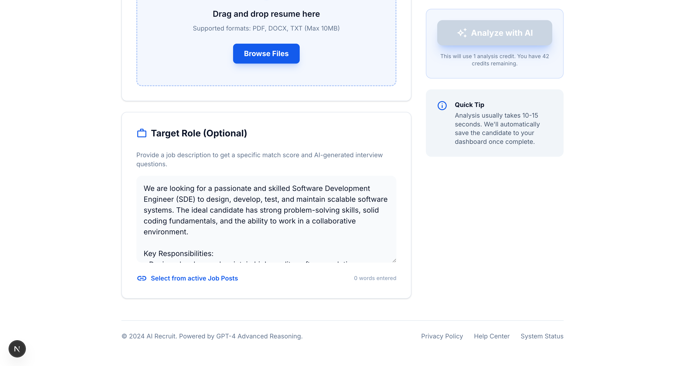
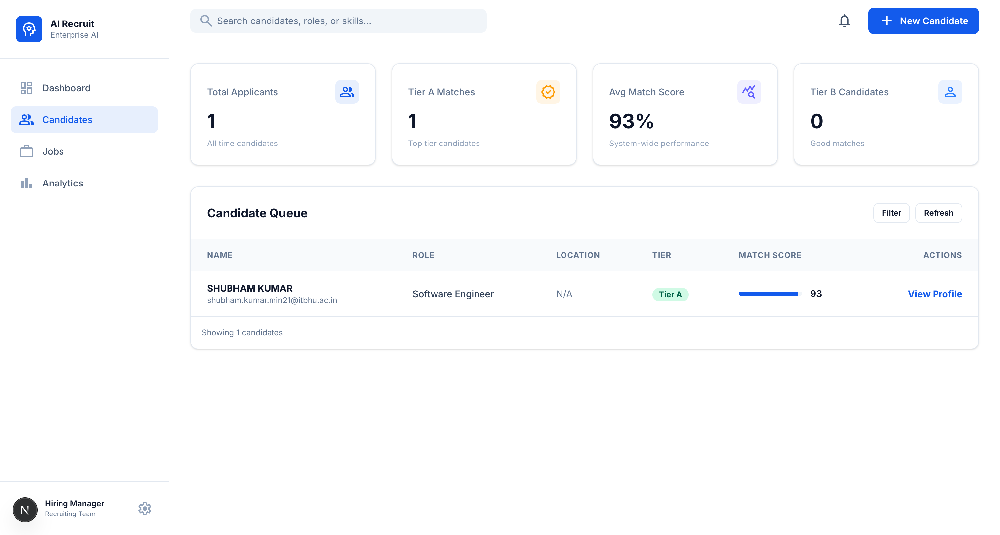
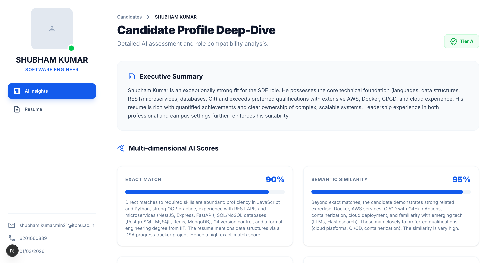
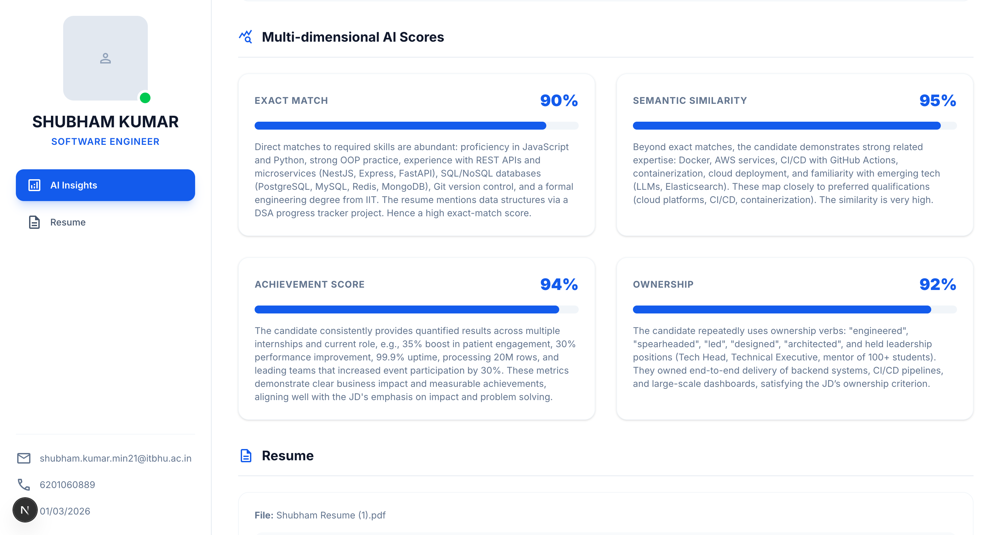
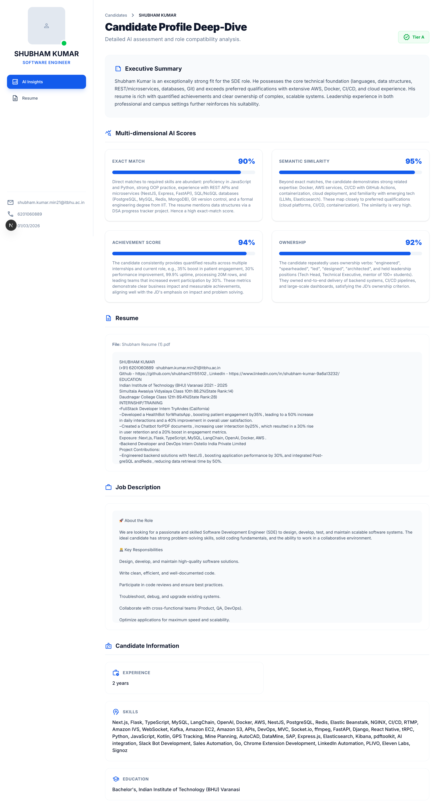

# AI Resume Shortlisting Assistant

An AI-powered resume evaluation system that compares candidate resumes against job descriptions and provides multi-dimensional scoring with explainability using Llama 3 via Groq API.

## 🖼️ Screenshots

### Home Page - Resume Upload Form


### Resume Upload with Job Description


### Candidates Dashboard


### Evaluation Results - Summary & Tier


### Evaluation Results - Multi-dimensional Scores


### Candidate Profile - Full Details


## 🎯 Features

## Project Structure

```
kamal-assignment/
├── resume-shortlisting-assistant/    # Backend (Python)
│   ├── app.py                        # Streamlit frontend
│   ├── api.py                        # Flask REST API server
│   ├── engine.py                     # Core evaluation logic
│   ├── requirements.txt              # Python dependencies
│   └── venv/                         # Python virtual environment
│
├── frontend/                         # Frontend (Next.js)
│   ├── app/                          # Next.js app directory
│   │   ├── page.tsx                  # Main application page
│   │   └── layout.tsx                # Root layout
│   ├── package.json                  # Node.js dependencies
│   └── README.md                     # Frontend documentation
│
├── start.sh                          # Quick start script
└── README.md                         # This file
```

## Features

- **Multi-dimensional Scoring (0-100):**
  - Exact Match: Direct keyword and skill matches
  - Similarity Match: Semantic understanding of related technologies
  - Achievement/Impact: Measuring quantifiable results
  - Ownership: Assessing leadership and responsibilities

- **Tier Classification:**
  - Tier A: Fast-track hire
  - Tier B: Technical screen recommended
  - Tier C: Needs further evaluation

- **Explainability:** Detailed explanations for every score

## Quick Start

### Option 1: Using Test Script (Verify Integration First)

```bash
./test-integration.sh
```

This will check if:
- Flask backend is running
- Next.js frontend is configured
- API connection is working

### Option 2: Manual Setup

#### Step 1 - Start Flask Backend

```bash
cd resume-shortlisting-assistant
source venv/bin/activate
python api.py
```

Backend runs on: **http://localhost:5001**

#### Step 2 - Start Next.js Frontend (in new terminal)

```bash
cd frontend
npm install
npm run dev
```

Frontend runs on: **http://localhost:3000**

#### Step 3 - Open Your Browser

Navigate to **http://localhost:3000**

You should see:
- A green "Backend Connected" status indicator
- The AI Resume Shortlisting Assistant interface

### Option 3: Streamlit Frontend (Original)

```bash
cd resume-shortlisting-assistant
source venv/bin/activate
streamlit run app.py
```

Open [http://localhost:8501](http://localhost:8501)

## Prerequisites

- Python 3.9+
- Node.js 18+
- Groq API Key (get free at [console.groq.com](https://console.groq.com))

## Environment Setup

1. **Set up Python backend:**
   ```bash
   cd resume-shortlisting-assistant
   python -m venv venv
   source venv/bin/activate
   pip install -r requirements.txt
   ```

2. **Configure API Key:**
   ```bash
   # Create .env file
   echo "GROQ_API_KEY=your_api_key_here" > .env
   ```

3. **Set up Next.js frontend:**
   ```bash
   cd frontend
   npm install
   ```

## Tech Stack

| Component | Technology |
|-----------|------------|
| Frontend | Next.js 15, React, TypeScript, Tailwind CSS |
| Backend API | Flask, Python 3.9+ |
| AI/LLM | Groq (Llama 3 70B) |
| PDF Parsing | pypdf |
| Structured Output | Pydantic |
| Prompt Management | LangChain |

## Architecture

```
┌─────────────────┐         ┌──────────────────────┐         ┌─────────────────┐
│  Next.js App    │────────▶│  Flask API Server    │────────▶│  Groq LLM API   │
│  (port 3000)    │  HTTP   │  (port 5001)         │         │                 │
└─────────────────┘         └──────────────────────┘         └─────────────────┘
       Frontend                    Backend                         AI
```

## API Endpoints

### Flask API Server (port 5001)

- `GET /health` - Health check
- `POST /api/evaluate` - Evaluate a resume

**Request:**
```
POST /api/evaluate
Content-Type: multipart/form-data

{
  "jobDescription": "string",
  "resume": "file (PDF)"
}
```

**Response:**
```json
{
  "tier": "Tier A",
  "summary": "...",
  "exact_match": { "score": 85, "explanation": "..." },
  "similarity_match": { "score": 78, "explanation": "..." },
  "achievement_impact": { "score": 72, "explanation": "..." },
  "ownership": { "score": 80, "explanation": "..." }
}
```

## Development

### Running Tests

```bash
cd resume-shortlisting-assistant
python test_engine.py
```

### Adding New Features

1. Modify `engine.py` for evaluation logic changes
2. Modify `api.py` for API changes
3. Modify `frontend/app/page.tsx` for UI changes

## Troubleshooting

**Flask API not responding:**
- Ensure the venv is activated
- Check that port 5001 is not in use
- Verify GROQ_API_KEY is set

**Next.js build errors:**
- Run `npm install` to ensure dependencies are installed
- Clear Next.js cache: `rm -rf .next`

**Streamlit issues:**
- Update streamlit: `pip install --upgrade streamlit`
- Clear cache: `rm -rf .streamlit`

## License

MIT
